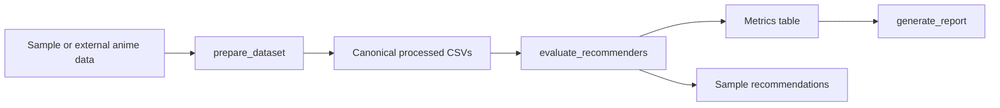

# Architecture

## Portfolio Framing

AniVibe should be presented as a recommender-system engineering project first
and a full-stack app second. The technical artifact is the reproducible ML
pipeline:

## Current Foundation Layer

The first layer is fully local:

- no Supabase requirement
- no Modal requirement
- no Redis requirement
- no frontend requirement
- no login/account requirement

This keeps the core recommendation work reproducible for GitHub reviewers.

## Next Backend Layer

After the offline benchmark is stable, the FastAPI layer should expose a small
portfolio API around the same recommender interface:

- `GET /health`
- `GET /models`
- `POST /recommend`
- `POST /similar-anime`
- `POST /evaluate`

Auth, social, reviews, dashboards, and account features should stay out of the
main portfolio path until the recommender core is already credible.
